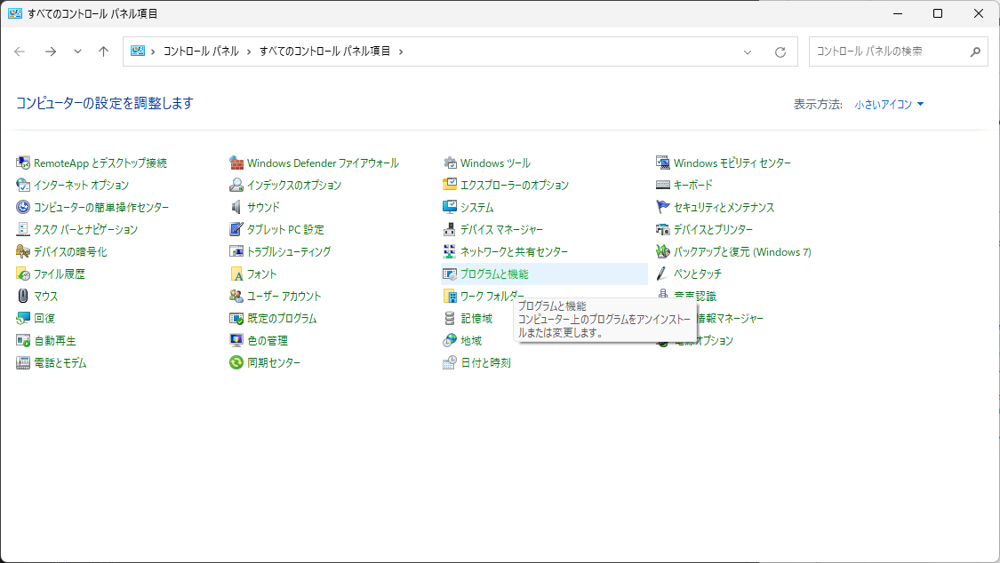
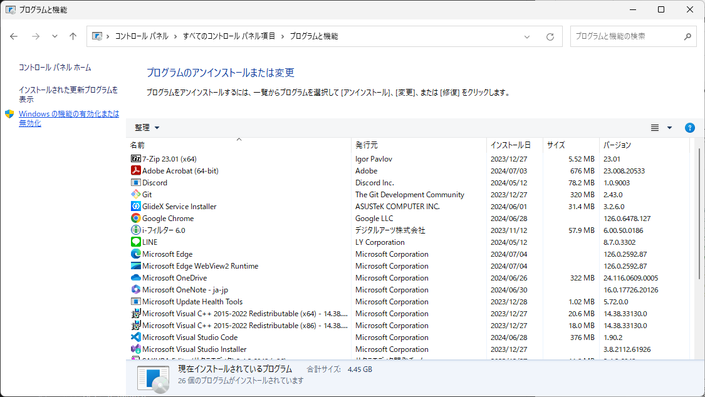
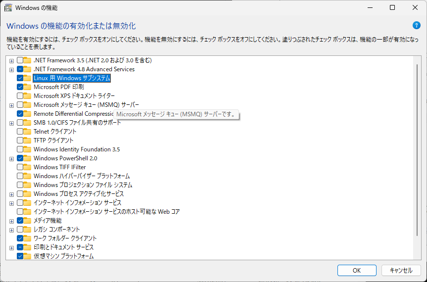

<!--
    WSLをインストールする手順を示す。
 -->

# WSLをインストールする手順

WSL(Windows Subsystem for Linux)をインストールする手順を示します。

本手順は[Microsoftの公式手順][wsl]を参照しています。

[wsl]: https://learn.microsoft.com/ja-jp/windows/wsl/install

ここでは、WSL上にUbuntuをインストールする前提で進めます。

## 1. 準備(Windows機能の有効化)

`コントロールパネル` > `プログラムと機能` > `Windowsの機能の有効化または無効化`
の順に開いて、下記にチェックを入れます。

* Linux用Windowsサブシステム
* 仮想マシンプラットフォーム







## 2. WSLのインストール

### 2.1. Windows PowerShellを起動する

スタートメニューから検索するか、`Win + R`で「ファイル名を指定して実行」を起動し、
「powershell.exe」と入力して起動させる。

### 2.2. WSLのサブパッケージを更新する

``` powershell
wsl --update
```

### 2.3. WSLのデフォルトバージョンを設定する

``` powershell
wsl --set-default-version 2
```

## 3. Ubuntuのインストール

### 3.1. Ubuntuをインストールする

``` powershell
wsl --install ubuntu
```

### 3.2. 初回起動時の設定を行う

ユーザ名とパスワードを入力してください。

``` none
...
Enter new UNIX username: <user-name>
New password: <password>
Retype new password: <password>
...
```

**インストール完了です。**

> [!TIP]
>
> **WSLバージョンの確認**
>
> ``` powershell
> wsl --version # -v でもOK
> ```
>
> **ディストリビューションの起動**
>
> ``` powershell
> wsl -d <distro-name>
> ```
>
> **WSLと実行中ディストリビューションの停止**
>
> ``` powershell
> wsl --shutdown
> ```
>
> **インストール可能なディストリビューションの確認**
>
> ``` powershell
> wsl --list --online # -l -o でもOK
> ```
>
> **インストール済みのディストリビューションの確認**
>
> ``` powershell
> wsl --list --version # -l -v でもOK
> ```
>
> **インストール済みのディストリビューションの削除**
>
> ``` powershell
> wsl --unregister <distro-name>
> ```
>
> **ディストリビューションのエクスポート**
>
> ``` powershell
> wsl --export <distro-name> <file-name>.tgz # .tgzの場合
> ```
>
> ``` powershell
> wsl --export --vhd <distro-name> <file-name>.vhdx # .vhdxの場合
> ```
>
> **ディストリビューションのインポート**
>
> ``` powershell
> wsl --import <distro-name> <import-dir-path> <file-name>.tgz # .tgzの場合
> ```
>
> ``` powershell
> wsl --import --vhd <distro-name> <import-dir-path> <file-name>.tgz # .vhdxの場合
> ```
